# `Chapter 2`
  - Data Models,Schemas and instances
  - Three Schema Architecture and data independence 
  - Database language and interfaces
  - The Database System Environment
  - Centralized and Client/Server Architectures of DBMSs
  - Classification of Database Management System

`Data Models`

  
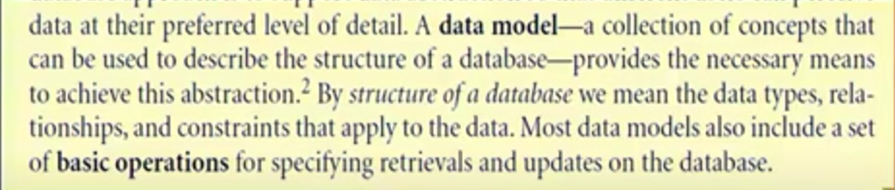

من اهم المزايا اللي بيوفرها الداتا بيز انه بيحقق مفهوم ال Data Abstraction بيخفي عن اليوزر حاجات هو مش محتاجها .
وال relationships اللي بتكون بين اكتر من entities.
وال constraints هي القيود اللي بطبقها علي الداتا .
ومعظم الداتا بيز بيكون فيها بعض العمليات بحيث اقدر اشوف الكويرز ومن خلالها اقدر اعمل ريتريف او ابديت للداتا بيز .

طب انا دلوقت بصنف المودل بناءا علي اي بصنف المودل بناءا علي الكوليكشن اوف كونسبت اللي من خلاله اقدر اوصف الداتا بيز .
## Categories of Data Model
  - High-level  or Conceptual Data Model مفيهوش تفاصيل كتير 
  - low-level or physical Data model تفاصيله كتير مقارنة بالاتنين التانيين
  - implementation or representational data model معظم ال DBMS تستخدم هذا النوع من ال Data model. 

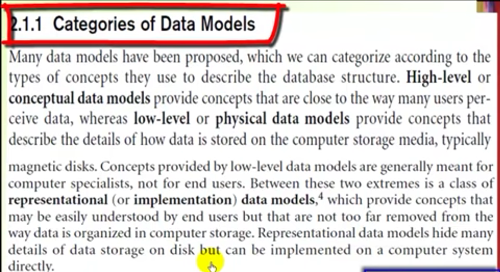
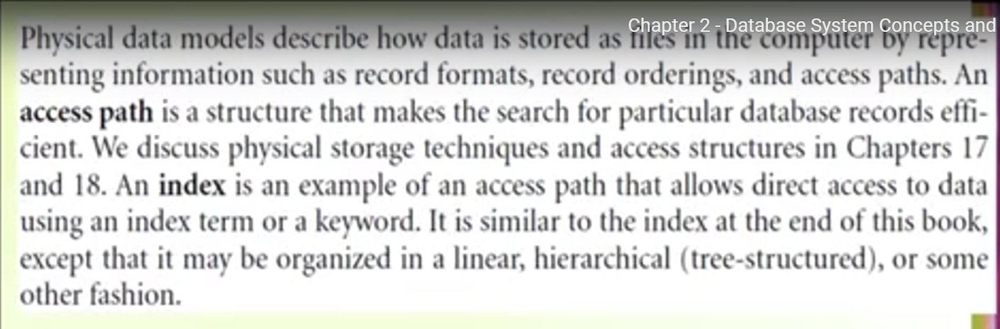

## what is The difference between Relationship,entity and attribute

Entity هو object بحتفظ بالوصف بتاعه في الداتا بيز
 
Attribute هو الخصائص اللي بوصف بيها الانتتي 
 
Relationship تكون بين اكتر من Entity.

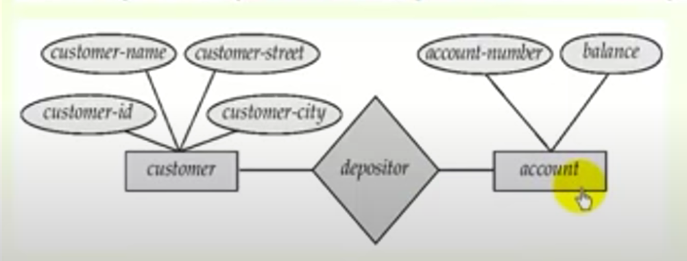
 
في الشكل 2 Entity هحتفظ بالوصف بتاعهم داخل الداتا بيز الوصف بتاع ال Entity الاول يحتوي علي الاسم والشارع والاي دي والمدينة الاربعة يمثلوا ال attribute of Entity 1 
وال Entity 2 اسمه account له   Attribute 2 اسمها name و balance واللي بيربط بين ال two Entities هو relationship اسمها depositor.

`Schema`

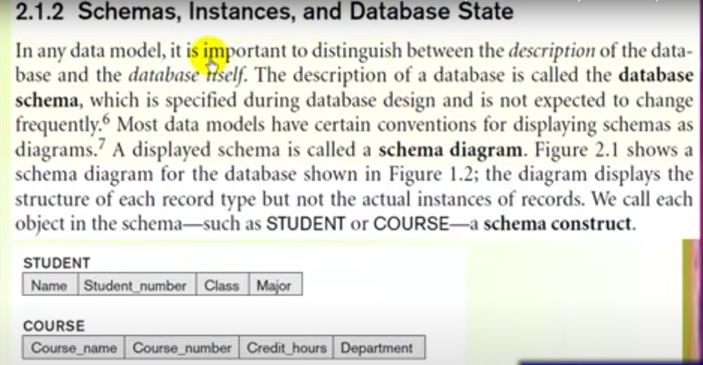

The Description of Database is called Schema.
وصف قاعدة البيانات يمثل Schema.

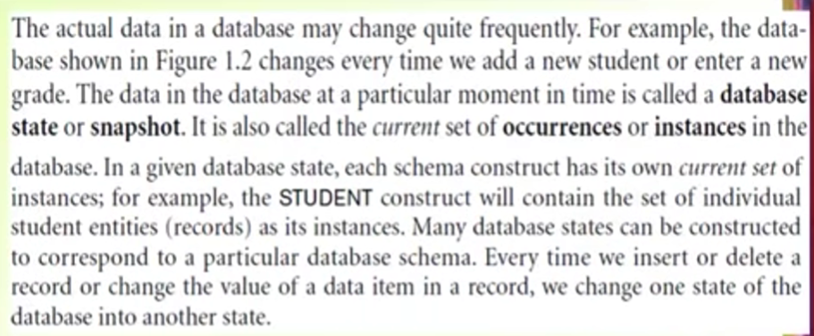

حالة قاعدة البيانات من غير ميحصل فيها اي عملية تعديل اسمها Database State or Snapshot.

`Three Schema Architecture and data independence`

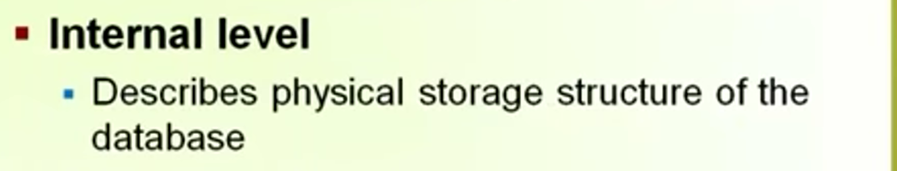
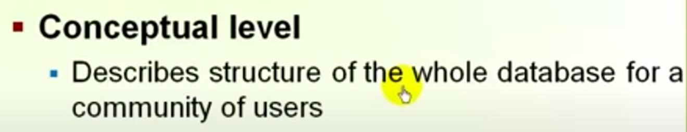
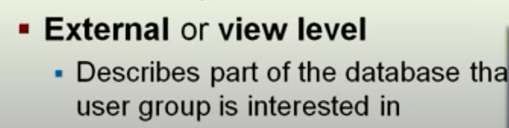
ال Scheme بت describe  the structure of the database not how to access it. وتنقسم الي ثلاث levels:internal,external,reprsentaional schema.

#### Internal Schema
The internal schema use low level data model.
The internal schema use intenal data mode that describe the storage structure of database .
فيها تفاصيل كتير وبتهتم بوصل ازاي الداتا بتتخزن في الداتا بيز وطريق الوصول للداتا دي.

#### Conceptual Schema
النوع دا بيخفي جزء من وصف الداتا اللي بتتخزن بس بيهتم بوصف الداتا تايبس والكونسترنز والاوبريشت اللي اليوزر بيعملها والنوع دا بيستخدم reprsentioal data model.
#### External Schema 
بي describe الوصف بتاع الداتا بيز الخاص بجروب معين  وليس بشكل عام للكل .

## Data independance
هي امكانية التعديل في ال high level schema بدون الحجاة للتعديل في ال low level schema.
   * Logical Data independance
    : هي امكانية التعديل في ال conceptual level schema بدون التأثير علي ال External schema.
   * Physical Data independence
   :هي امكانية التعديل في ال internal schema بدون الحاجة للتعديل في ال conceptual schema.

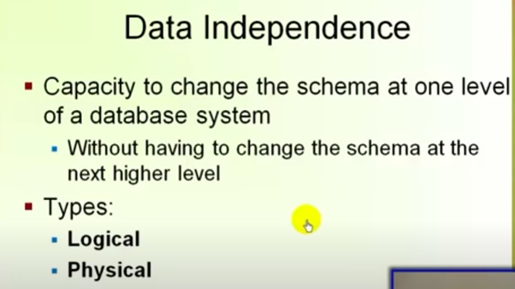

`Database language and interfaces`
  * DDL  (Data Definition Language) : اللغة اللي ببني بيها قاعدة البيانات
  * SDL (Storage Defintion language)
  * VDL (view Defintion language)
  * Data manipulation language : اللغة اللي من خلالها اقدر اعدل في قاعدة البيانات او استرجع داتا منها.
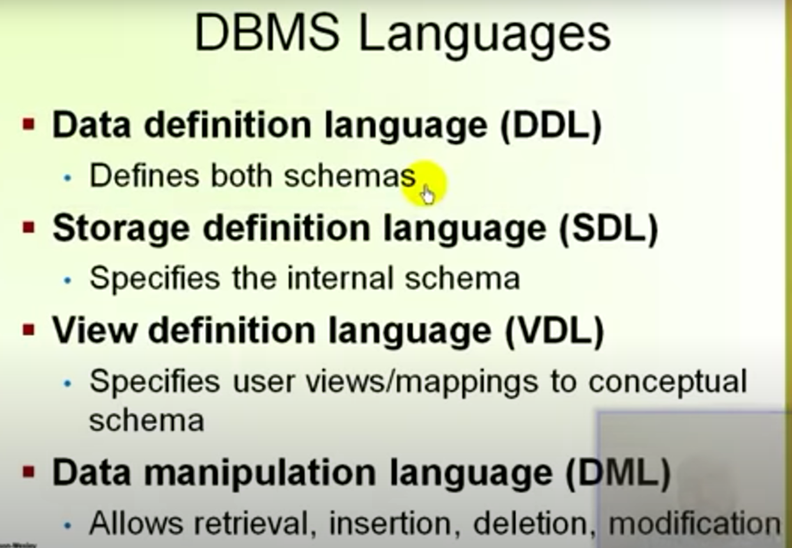

`The Database System Environment`

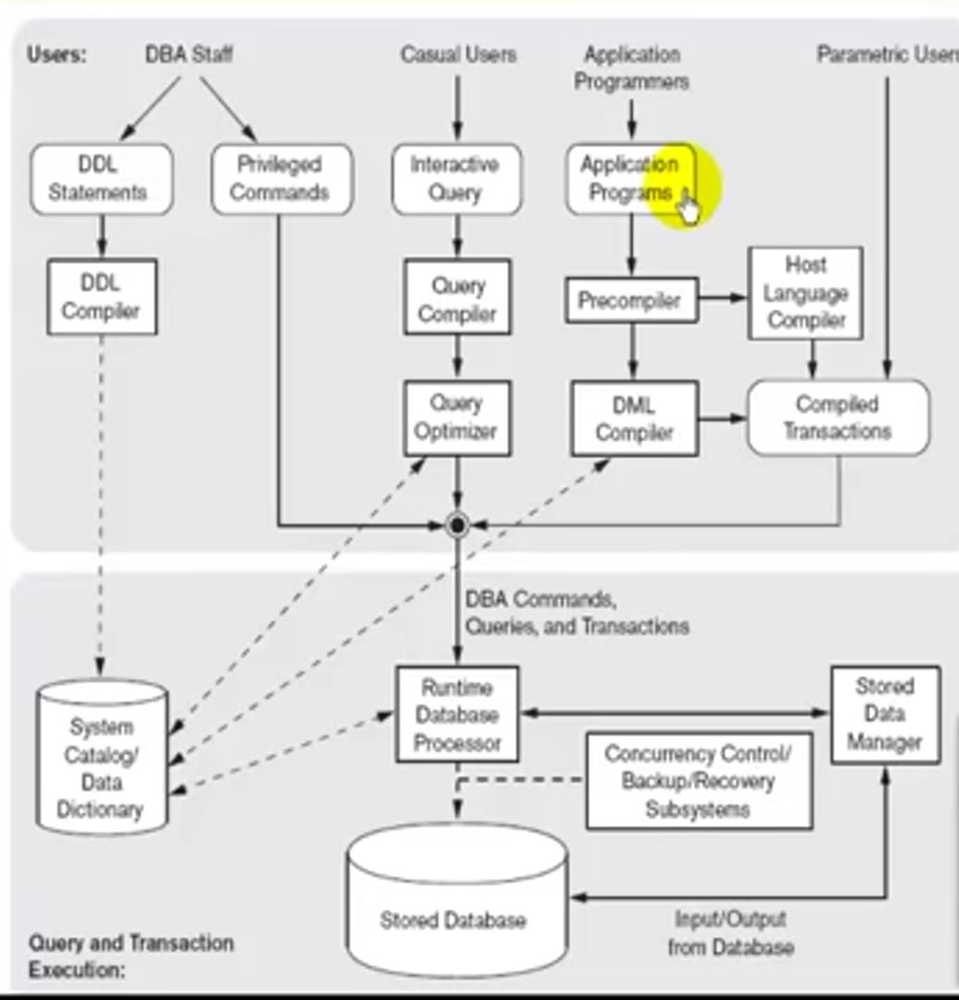

`Centralized and Client/Server Architectures of DBMSs`

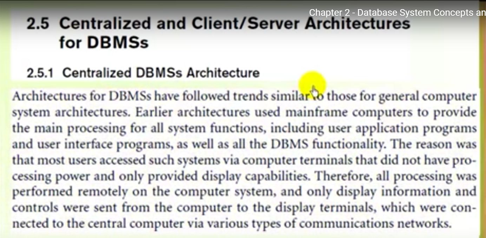
الاركتكشر الخاص بال DBMS يشبه الاركتكشر الخاص بالكمبيوتر القديم بيكون عندي مينفريم كمبيوتر امكانياته عالية اوي بيعمل كل processing لكل ال functionallity المطلوبة منه زي application programs and user interface programs as well as the database functionallity.ال terminals تكون متصلة بال minframe ترسل الداتا له بحيث يتعملها بروسيسنج وترجع تتعرض تاني ك output علي ال terminal.ال terminal مبيحصلش فيها اي حاجة غير ان الداتا بتتعرض عليها وتكون متصلة بال mainframe computer عن طريق communication network.

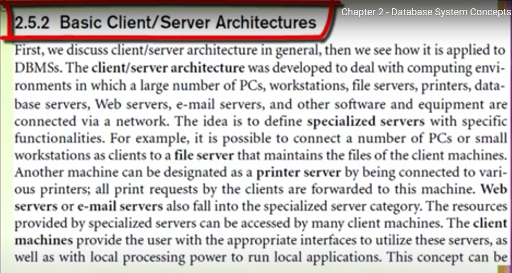

الفكرة الاساسية هنا اني مخليش الشغل centralized عند حته معينة فهوزع الشغل بين ال server وال client شغل هيتم عن ال server وشغل هيتم عند ال client .من وجهة نظر الداتا بيز يتم تقسيم ال Client/Server Architecture الي نوعين 
Two-Tier Client/Server DBMS and Three-Tier  Client/Server Architecture
* The Two-tier 
بيكون متقسم لجزئين جزء فيه user interface programs and application programs ودول بيكونو عند الكلاينت والجزء التاني اللي هوا الداتا بيز نفسها بيكون عن السيرفر اسم السيرفر Query Server or Transaction Server or SQL Server.

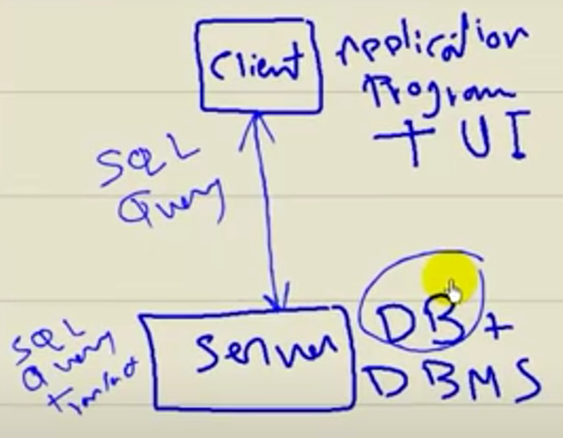

* The Three-tier Client/Server Architectuer:
بيتكون من 3 layer الاولي لل client ويكون فيها user interface programs والطبقة التانية يكون فيها application programs or business rules والطبقة التالتة يكون فيها DBMS and DB.
Three Layers (client-Server-Application Server or Web Server)

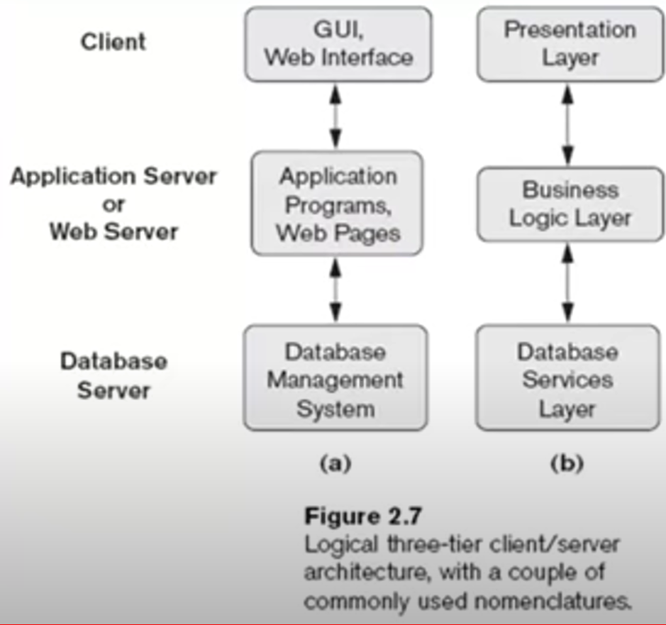